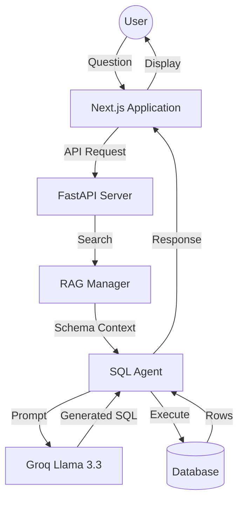

# 📄 Project Overview: Textual SQL

## 🎯 Our Mission
The mission of **Textual SQL** is to democratize data access. We eliminate the need for non-technical users to learn complex SQL syntax, allowing them to extract insights from their data simply by asking questions.

## 🧠 Technical Implementation

### 1. Retrieval-Augmented Generation (RAG)
Textual SQL uses a sophisticated RAG pipeline to ensure the LLM has a perfect understanding of your database:
- **Schema Indexing**: Upon connection, the backend traverses the database metadata to build a structured representation of every table, column, and relationship.
- **Context Injection**: When a user asks a question, we retrieve the relevant portions of this schema and inject them into the LLM's prompt. This allows the model to generate syntactically correct SQL tailored to *your* specific database.

### 2. Large Language Model (LLM) Integration
We leverage **Groq's Llama-3.3-70b-versatile** model for high-precision SQL generation. 
- **Prompt Engineering**: System instructions enforce strict SQL-only output, preventing hallucinated explanations.
- **Error Handling**: The agent validates the generated SQL against the active database before returning results.

### 3. Visual Excellence (Aesthetics)
We believe powerful tools should also be beautiful:
- **Three.js Background**: The application features a dynamic, interactive "Dotted Surface" that visualization data relationships in motion.
- **Next.js & Tailwind**: A fully responsive, dark-themed UI designed for professional environments.

## 📊 High-Level Architecture

## 🌟 Key Achievements
- **Seamless Setup**: logical flow from Intro -> Config -> Chat.
- **Demo Mode**: One-click connection to sample data to lower user friction.
- **Security First**: Sensitive credentials are masked and never exposed in cleartext after setup.
