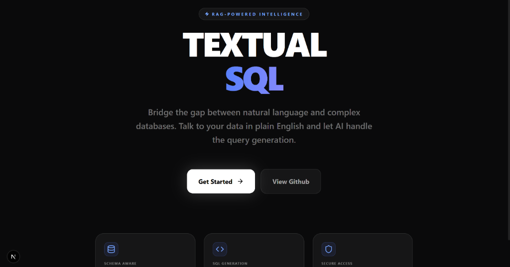

# 🤖 Textual SQL - Bridge the Gap Between Language and Data

Textual SQL is a premium, AI-powered platform that allows you to talk to your databases in plain English. Powered by RAG (Retrieval-Augmented Generation) and Groq's high-performance LLMs, it converts natural language queries into optimized SQL in seconds.



## ✨ Features

- **Intuitive Landing Page**: A stunning Three.js-powered animated background for a premium user experience.
- **Dynamic Database Setup**: Easily connect your PostgreSQL or SQLite database through a secure setup interface.
- **RAG-Powered Intelligence**: Automatically indexes your database schema to provide context-aware SQL generation.
- **Intelligent SQL Chat**: Deep-learning powered translation of natural language to SQL.
- **Secure & Private**: Support for transaction pooler URLs and local credential persistence.

## 🚀 Quick Start

### Prerequisites
- Python 3.10+
- Node.js 18+
- Groq API Key

### 1. Backend Setup
```bash
cd backend
pip install -r requirements.txt
python main.py
```
*Note: Ensure your `.env` file contains your `GROQ_API_KEY`.*

### 2. Frontend Setup
```bash
cd frontend
npm install
npm run dev
```
Visit `http://localhost:3000` to start.

## 📁 Project Structure

- `backend/`: FastAPI server handling SQL generation, RAG logic, and database connections.
- `frontend/`: Next.js application with a focus on high-end aesthetics and interactive user flow.
- `chinook.db`: Sample database for testing and demos.

## 🛠️ Built With

- **Frontend**: Next.js, Tailwind CSS, Three.js, Lucide React.
- **Backend**: FastAPI, SQLAlchemy, LangChain, Groq (Llama 3.3).
- **Database**: PostgreSQL, SQLite.

---
Created with ❤️ by Vedant Pandhare
